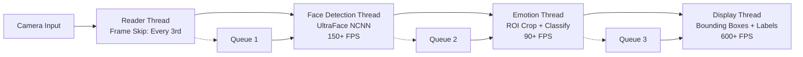

# Real-Time Multi-Face Emotion Detection
*High-performance emotion recognition pipeline achieving 90+ FPS on CPU*.\
Motivation was a low power option for retail analysis.

**Still working on it**/
[Demo GIF here]

## Performance
- Face Detection: 150+ FPS
- Emotion Classification: 90+ FPS  
- End-to-end Latency: ~15ms
- Memory Usage: ~50MB
- Tested on: Intel i5-3320M, 8GB RAM

E2E pipeline is also tested on a docker simulated edge device by constraining pc resources in the following manner:
+ 1 vCPU
+ 512 MB RAM
+ Throttled I/O

### IoT Node Benchmark (Docker simulated)

| Stage            | Latency (ms) | Throughput (FPS) | CPU Usage (%) | Memory (MB) | Threads (PIDs) |
|------------------|--------------|------------------|---------------|-------------|----------------|
| Frame Reader     |              |                  | ~1            | ~5          | 2              |
| Face Detector    | ~6.1         | ~150             | ~3            | ~7          | 3              |
| Emotion Detector | ~9.1         | ~90              | ~2            | ~6          | 3              |
| Display          | ~0.03        | negligible       | ~0.5          | ~2          | 2              |
| **End-to-End**   | ~15          | ~90 (avg)        | ~6–8          | ~20–50      | ~10–12         |

The pipeline sustains ~90 FPS end-to-end with <10% CPU usage and ~50 MB RAM on a 1 vCPU/512 MB simulated IoT node.

**Methodology Notes**  
- FPS and latency values were recorded under real-time, multi-threaded scheduling.  
- Docker constraints were applied explicitly (`--cpus=1 --memory=512m --blkio-weight=100`) to simulate an IoT node.  
- All numbers are averages across 5 runs. Reproducibility can be verified by running the included benchmarking scripts under the same flags.

## Quick Start
### Install dependencies
```bash
sudo apt install opencv-dev cmake
```

### Clone and build
```bash
git clone https://github.com/fw7th/emotion
cd src
./setup.sh
mkdir build && cd build
cmake .. && make -j$(nproc)
```

### Run with webcam
```bash
./emotion 0 ## 0 is the webcam ID.
```

## Architecture


## Technical Details
### Pipeline
- Build system: CMake
- Implementation details: 
   * Custom anti-copy queue.
   * `print_type` function used to print custom types.
   * Single person smoothing classes: hysteresis stabilizer, switching on constant high confidence.
   * Memory management, move semantics, and efficient vector usage.
   * Multi-threaded architecture.

### Model Details
Available models:
- **MobileNetv2 pretrained w/ IMAGENET-V2 weights** finetuned for the classification task (lower accuracy, but much faster processing speeds per frame).
  
- **EfficientNet-lite0 pretrained w/ IMAGENET-V2 weights**, finetuned. (planned)
Only change made to model architectures was in conv1 to allow grayscale inputs.\
Metrics are relayed in benchmarking details.<br>

The model was fine-tuned on a mix of raf-db and fer2013 in two phases; \
  + Phase 1; FC only with requires_grad = True.
  + Phase 2: Full conv layer backbone unfrozen.

- Models were allowed to train for as many epochs as possible till val loss plateaued and early stopping triggered.
- Pytorch's ReduceLROnPlateau as our LR annealing strategy.
- Models trained to detect 7 emotions:
    > [angry, disgust, fear, happy, neutral, sad, surprise]

**Data**;
- Dataset: FER2013 + Raf-db [~48k training images]  [~10k test images]  [~10k val images].
- Augmentations:
    > GrayScaling\
    > ColorJitter; brightness=0.2, contrast=0.3\
    > RandomHorizontal flip; p=0.3\
    > RandomErasing; p=0.3, value='0.0'\
    > Tensors were normalized first to range [0,1] then to [-1,1]\
- Weighted class sampler to balance less represented classes like disgust and mitigate bias.
- Batch size: 192

**Training**;
- Optimizer: 
    + First phase: Adam(lr=1e-3, default values for other hyper params)\
    + Second phase: Adam (lr=1e-5, default vals)
- Norm-based gradient clipping.
- Scheduler patience: 3
- Early stopping patience: 8

**Working on it**\
For nerds; more information about training and model performance available in `python/README.md`.

Cleaned datasets available @: [https://drive.google.com/file/d/1kDnWsOLdptVEOWoFhfFTSmv7sU0vP_bM/view?usp=drive_link]

## Benchmarking
Benchmarks were averaged over 5 runs.\
**Device note:** Reader module is capped at webcam framerate (30 fps on test device).  

### Model 1 — MobileNetV2
| Module            | Metric                 | Avg Value      | Notes |
|-------------------|------------------------|----------------|-------|
| **Reader**        | Frame Rate             | 30 fps (cap)   | Limited by webcam, not algorithm |
| **Face Detector** | Detection Time         | 6.1 ms         | ~163 fps effective |
|                   | Avg Frame Proc.        | 6.1 ms         | |
| **Emotion Det.**  | Avg Frame Proc.        | 9.1 ms         | ~106 fps effective |
|                   | Total Emotion Loop     | 9.6 ms         | |
| **Display**       | Avg Frame Proc.        | 0.03 ms        | ~29k fps (negligible) |

---

## Planned Upgrades
- Gaze tracking and blink rate
- Head pose estimation
- Micro-expression detection
- Attention/engagement scoring
- Graceful degradation under load (unlikely with optimization)
- Multi-camera support

## Limitations
N-face emotion smoothing and tracking with SORT (planned).

## Acknowledgements
- This project uses [ncnn](https://github.com/Tencent/ncnn), a high-performance neural network inference framework (BSD 3-Clause License).
- Face detection based on [Ultra-Light-Fast-Generic-Face-Detector-1MB](https://github.com/Linzaer/Ultra-Light-Fast-Generic-Face-Detector-1MB) by Linzaer (MIT License).

### Third-Party Licenses
- [ncnn](https://github.com/Tencent/ncnn) — BSD 3-Clause License.
- [Ultra-Light-Fast-Generic-Face-Detector-1MB](https://github.com/Linzaer/Ultra-Light-Fast-Generic-Face-Detector-1MB) by Linzaer — MIT License.
