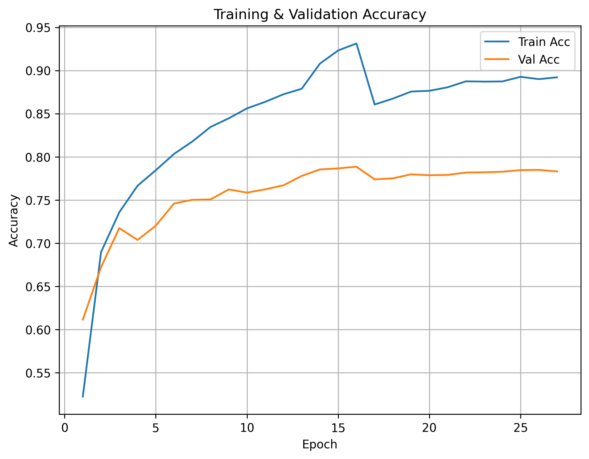
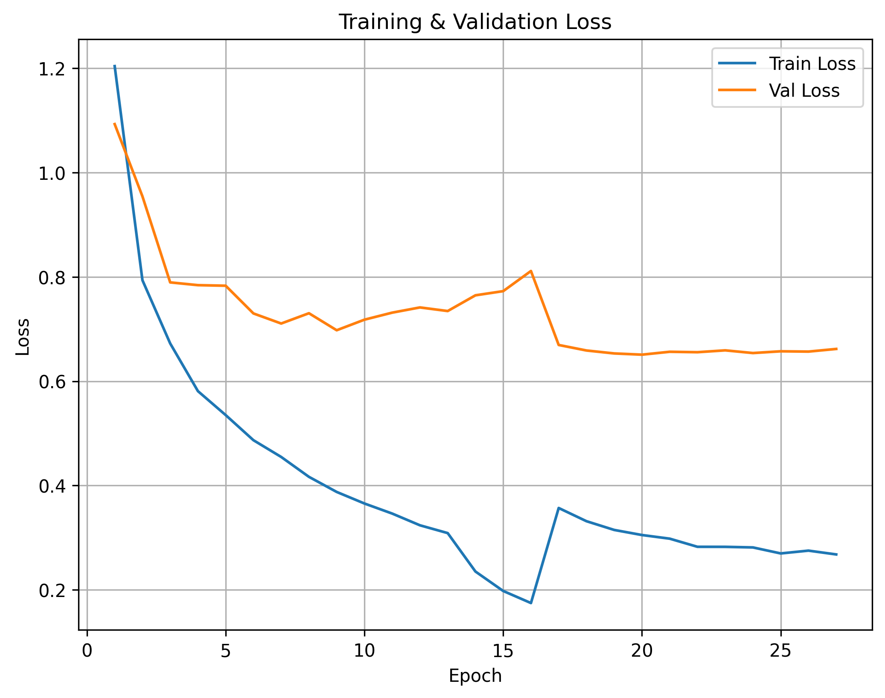

# Training Pipeline
## Environment Setup
- Python 3.12.11
- Torch 2.8.0

### Dependencies: 
matplotlib==3.10.6\
numpy==2.3.3\
Pillow==11.3.0\
scikit_learn==1.7.2\
seaborn==0.13.2\
thop==0.1.1.post2209072238\
torchvision==0.23.0+cu126\
tqdm==4.67.1

## Training Process
Two-stage training with learning rate annealing:

**Stage 1:** Full model training
- Learning rate: 1e-3
- Train until validation loss plateaus
- Save best checkpoint

**Stage 2:** Fine-grained refinement  
- Load best checkpoint from Stage 1
- Learning rate: 1e-5
- Train until early stopping

This approach allows the full network to adapt to the emotion recognition task while the higher initial learning rate enables faster convergence.\
**Key finding:** Traditional layer-freezing fine-tuning underperformed on this combined dataset.

### Cross-Dataset Generalization
Initial experiments trained on RAF-DB (controlled studio conditions) and tested on FER2013 (in-the-wild). Severe domain shift caused poor generalization. Final approach combines both datasets for training, improving robustness to varying image quality and lighting conditions.

Train, test and val sets were combined per class.\
 
- RAF-DB: (~35k images)
    fear: 5103 images\
    neutral: 4902 images\
    happy: 5023 images\
    angry: 4550 images\
    sad: 4994 images\
    surprise: 5231 images\
    disgust: 4857 images

- FER2013: (~34k images)
    fear: 4724 images\
    neutral: 6053 images\
    happy: 8733 images\
    angry: 4529 images\
    sad: 5581 images\
    surprise: 3833 images\
    disgust: 483 images

### Ablation Results
| Approach                                 | Val Accuracy |
|------------------------------------------|--------------|
| Standard fine-tuning (freeze → unfreeze) | ~73.8%       |
| EfficientNet-lite0                       | ~77.4%       |
| Two-stage full training (selected)       | ~79.3%       |

### Data Preparation
- Combined FER2013 + RAF-DB:
> This was done to "balance" what a model would expect, RAF-DB has more structured clean faces displaying obvious emotion, meanwhile, FER2013 contains much more of a varied distribution of faces per class, much more realistic "in the wild" expressions as well as blurry class boundaries.

- Train/Val/Test split methodology:
> The split is 70% train, 15% test and val each, the splits were not weighted to contain one dataset over another, but a random contribution from each dataset.

+ Train split: 
    fear: 6879 images\
    neutral: 7669 images\
    happy: 9630 images\
    angry: 6356 images\
    sad: 7403 images\
    surprise: 6345 images\
    disgust: 3738 images

+ Test & Val split (same):
    fear: 1474 images\
    neutral: 1643 images\
    happy: 2063 images\
    angry: 1361 images\
    sad: 1586 images\
    surprise: 1359 images\
    disgust: 801 images

- Class balancing strategy:
Two class balancing strategies are deployed;
    + Weighted random sampler
    + Class weights used in criterion (CrossEntropyLoss)

- Normalization:
We normalize the pixel range to [-1, 1], this contrasts ImageNet normalization, but it's done to center pixel values, we already lose some imagenet weight benefits from the modified conv head for grayscale inputs, as well as the image resolution during training (64x64 images).

### Model Architecture
- Base: MobileNetV2 (pretrained Imagenet-v2)
- Modifications: Conv1 adapted for grayscale
- Flops: ~26M
- Total parameters: ~2.23M
- Trainable parameters: ~2.23M (both phases)

### Hyperparameters
See main README for training hyperparameters

### Training Curves

*Training dynamics show typical convergence behavior. Spike at epoch ~15 indicates learning rate reduction by ReduceLROnPlateau scheduler. Final model selected based on best validation performance (epoch 16), not final epoch.*
